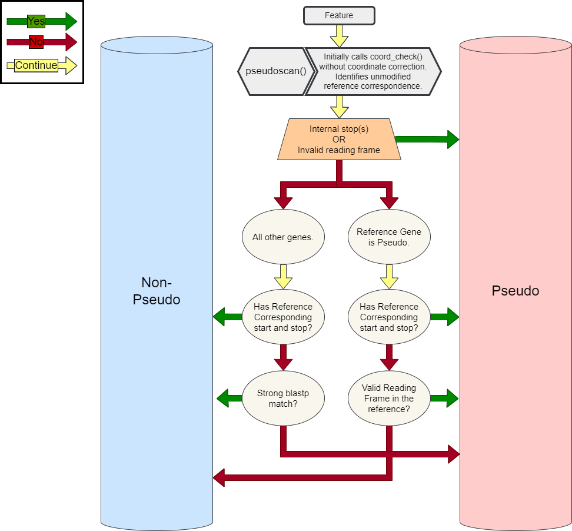

# pseudoscan

## Pseudo calling Criteria

-------

Without exception, assign `pseudo` if either condition is met:

  * The isolate gene contains an internal stop or ends with a non-valid stop codon.

  * The isolate gene has an invalid reading frame (not divisible by three).

-------

If the reference gene is `pseudo`, assign non-`pseudo` if both conditions are met:

  * The isolate gene does NOT have a reference-corresponding start or stop.

  * The reference gene has an invalid reading frame (not divisible by three).

Otherwise, assign `pseudo`

-------

For all other genes, assign non-`pseudo` if either condition is met:

  * The isolate gene has a reference-corresponding start AND stop.

  * The isolate gene has a strong blastp match at the user specified thresholds.

Otherwise, assign `pseudo`

-------

-------

## `note` qualifiers added by pseudoscan

Each pseudo gene in the final annotation will contain a `note` field describing the primary reason it was assigned the `pseudo` tag.
Also, some non-`pseudo` genes with interesting attributes will also contain notes describing why they are NOT marked `pseudo`, despite having a certain mutation.
See below for special pseudo notes assigned and the specific conditions that trigger them:

-------

> _Locus has a delayed stop codon_

When a gene has a valid stop that extends beyond the last aligned base to the reference gene.

-------

> _Locus has a valid alternative start site_

When a gene has a valid start codon that does NOT correspond with the reference.

-------

> _Locus has a valid alternative stop codon_

When a gene has a valid stop codon that does NOT correspond with the reference.

-------

> _Locus is (x) base pair(s) shorter than the reference_

When a gene has a reference-corresponding start and stop, and the reference gene is shorter than the isolate gene.

-------

> _Locus is (x) base pair(s) longer than the reference_

When a gene has a reference-corresponding start and stop, and the reference gene is longer than the isolate gene.

-------

## Report Format

{!pseudoscan.report-format.md!}
